# Zyntra HE Backend

Backend da aplicação Zyntra HE desenvolvido com Quarkus, seguindo os padrões de arquitetura em camadas (Model, DAO, BO, Resource).

## Estrutura do Projeto

```
src/main/java/br/com/fiap/
├── model/
│   ├── entity/     # Entidades JPA (Model)
│   └── dao/         # Data Access Object (DAO)
├── service/          # Business Object (Service/BO)
├── resource/        # REST Resources (Controllers)
└── exception/       # Tratamento de exceções
```

## Tecnologias

- **Quarkus 3.6.0** - Framework Java
- **Oracle Database** - Banco de dados
- **Hibernate ORM** - Persistência
- **RESTEasy Reactive** - API REST
- **Bean Validation** - Validações

## Requisitos

- Java 17+
- Maven 3.8+
- Oracle Database 12c+

## Configuração

1. Configure o banco de dados no arquivo `application.properties`:

```properties
quarkus.datasource.username=rm566133
quarkus.datasource.password=280201
quarkus.datasource.jdbc.url=jdbc:oracle:thin:@oracle.fiap.com.br:1521:ORCL
```

2. Execute os scripts SQL na ordem:
   - Primeiro: `zyntra_he_completo.sql` (cria as tabelas)
   - Depois: `zyntra_he_dados_exemplo.sql` (popula com dados de exemplo)

## Executando a Aplicação

### Modo Desenvolvimento

```bash
./mvnw quarkus:dev
```

A aplicação estará disponível em: `https://fiap-gs-java-2semestre.onrender.com`

### Modo Produção

```bash
./mvnw clean package
java -jar target/quarkus-app/quarkus-run.jar
```

## Endpoints da API

| Método | Endpoint | Descrição |
|--------|----------|-----------|
| **Usuários** |
| `POST` | `/api/usuarios` | Criar usuário |
| `POST` | `/api/usuarios/login` | Autenticar usuário |
| `GET` | `/api/usuarios/{id}` | Buscar usuário por ID |
| `PUT` | `/api/usuarios/{id}` | Atualizar usuário |
| `DELETE` | `/api/usuarios/{id}` | Remover usuário |
| **Mentorias** |
| `POST` | `/api/mentorias` | Criar mentoria |
| `GET` | `/api/mentorias` | Listar todas as mentorias |
| `GET` | `/api/mentorias/{id}` | Buscar mentoria por ID |
| `PUT` | `/api/mentorias/{id}` | Atualizar mentoria |
| `DELETE` | `/api/mentorias/{id}` | Remover mentoria |
| `POST` | `/api/mentorias/{id}/cancelar` | Cancelar mentoria |
| **Oficinas** |
| `POST` | `/api/oficinas` | Criar oficina |
| `GET` | `/api/oficinas` | Listar todas as oficinas (busca opcional) |
| `GET` | `/api/oficinas/{id}` | Buscar oficina por ID |
| `GET` | `/api/oficinas/cidade/{cidade}` | Buscar oficinas por cidade |
| `GET` | `/api/oficinas/estado/{estado}` | Buscar oficinas por estado |
| `PUT` | `/api/oficinas/{id}` | Atualizar oficina |
| `POST` | `/api/oficinas/{id}/aprovar` | Aprovar oficina |
| `DELETE` | `/api/oficinas/{id}` | Remover oficina |
| **Tutores** |
| `POST` | `/api/tutores` | Criar tutor |
| `GET` | `/api/tutores` | Listar todos os tutores (ativos opcional) |
| `GET` | `/api/tutores/{id}` | Buscar tutor por ID |
| `PUT` | `/api/tutores/{id}` | Atualizar tutor |
| `DELETE` | `/api/tutores/{id}` | Remover tutor |
| **Cursos** |
| `POST` | `/api/cursos` | Criar curso |
| `GET` | `/api/cursos` | Listar todos os cursos (ativos opcional) |
| `GET` | `/api/cursos/{id}` | Buscar curso por ID |
| `PUT` | `/api/cursos/{id}` | Atualizar curso |
| `DELETE` | `/api/cursos/{id}` | Remover curso |
| **Aulas de Curso** |
| `POST` | `/api/aulas-curso` | Criar aula |
| `GET` | `/api/aulas-curso` | Listar todas as aulas (cursoId, ativos opcional) |
| `GET` | `/api/aulas-curso/{id}` | Buscar aula por ID |
| `PUT` | `/api/aulas-curso/{id}` | Atualizar aula |
| `DELETE` | `/api/aulas-curso/{id}` | Remover aula |
| **Serviços de Oficinas** |
| `POST` | `/api/oficina-servicos` | Criar serviço |
| `GET` | `/api/oficina-servicos` | Listar todos os serviços (oficinaId, ativos opcional) |
| `GET` | `/api/oficina-servicos/{id}` | Buscar serviço por ID |
| `PUT` | `/api/oficina-servicos/{id}` | Atualizar serviço |
| `DELETE` | `/api/oficina-servicos/{id}` | Remover serviço |
| **Pontos de Recarga** |
| `POST` | `/api/pontos-recarga` | Criar ponto de recarga |
| `GET` | `/api/pontos-recarga` | Listar todos os pontos (tipo, busca opcional) |
| `GET` | `/api/pontos-recarga/{id}` | Buscar ponto por ID |
| `PUT` | `/api/pontos-recarga/{id}` | Atualizar ponto de recarga |
| `DELETE` | `/api/pontos-recarga/{id}` | Remover ponto de recarga |

## Documentação da API

Acesse a documentação Swagger/OpenAPI em:
- `https://fiap-gs-java-2semestre.onrender.com/api-docs`

## Deploy

### Docker

```bash
docker build -t zyntra-he-backend .
docker run -p 8080:8080 -e DB_HOST=host.docker.internal zyntra-he-backend
```

### Render / Railway

1. Configure as variáveis de ambiente:
   - `QUARKUS_DATASOURCE_USERNAME` - Usuário do banco Oracle
   - `QUARKUS_DATASOURCE_PASSWORD` - Senha do banco Oracle
   - `QUARKUS_DATASOURCE_JDBC_URL` - URL de conexão JDBC Oracle
   - `CORS_ORIGINS` - Origens permitidas para CORS

2. O Quarkus detecta automaticamente o ambiente e configura a aplicação.

**Exemplo de URL JDBC Oracle:**
```
jdbc:oracle:thin:@oracle.fiap.com.br:1521:ORCL
```

## Padrões Implementados

- **DAO (Data Access Object)** - Separação de acesso a dados
- **Service Layer** - Regras de negócio e validações
- **MVC** - Separação Model-View-Controller
- **JPA/Hibernate** - Mapeamento objeto-relacional
- **Exception Handling** - Tratamento centralizado de exceções (BusinessRuleException, ValidationException, ResourceNotFoundException)
- **REST** - Princípios REST com verbos HTTP apropriados
- **Bean Validation** - Validações de dados com anotações
- **Dependency Injection** - Injeção de dependências com CDI (@Inject)

## Diagrama de Classes

```mermaid
classDiagram
    %% ============================================
    %% CAMADA DE ENTIDADES (MODEL)
    %% ============================================
    
    class Usuario {
        -Long id
        -String email
        -String senha
        -String nome
        -LocalDateTime dataCriacao
        -LocalDateTime dataAtualizacao
        +getId() Long
        +getEmail() String
        +getSenha() String
        +getNome() String
    }
    
    class Tutor {
        -Long id
        -String nome
        -String especialidade
        -String email
        -String telefone
        -String ativo
        -LocalDateTime dataCriacao
        -LocalDateTime dataAtualizacao
        +getId() Long
        +getNome() String
        +getEspecialidade() String
    }
    
    class Curso {
        -Long id
        -String titulo
        -String descricao
        -String ativo
        -LocalDateTime dataCriacao
        -LocalDateTime dataAtualizacao
        -List~AulaCurso~ aulas
        +getId() Long
        +getTitulo() String
        +getDescricao() String
        +getAulas() List~AulaCurso~
    }
    
    class AulaCurso {
        -Long id
        -String titulo
        -String descricao
        -String url
        -String ativo
        -LocalDateTime dataCriacao
        -LocalDateTime dataAtualizacao
        -Curso curso
        +getId() Long
        +getTitulo() String
        +getUrl() String
        +getCursoId() Long
    }
    
    class Oficina {
        -Long id
        -String nomeEmpreendimento
        -String cnpj
        -String nomeEmpresa
        -String localizacao
        -String cidade
        -String estado
        -String especialidade
        -Double avaliacao
        -StatusOficina status
        -LocalDateTime dataCriacao
        -LocalDateTime dataAtualizacao
        -List~OficinaServico~ servicos
        +getId() Long
        +getNomeEmpreendimento() String
        +getCnpj() String
        +getStatus() StatusOficina
    }
    
    class OficinaServico {
        -Long id
        -String nome
        -String descricao
        -String ativo
        -LocalDateTime dataCriacao
        -LocalDateTime dataAtualizacao
        -Oficina oficina
        +getId() Long
        +getNome() String
        +getDescricao() String
        +getOficinaId() Long
    }
    
    class Mentoria {
        -Long id
        -String nomeCompleto
        -String cpf
        -String email
        -String telefone
        -LocalDate data
        -StatusMentoria status
        -LocalDateTime dataCriacao
        -Tutor tutor
        -Usuario usuario
        +getId() Long
        +getNomeCompleto() String
        +getStatus() StatusMentoria
    }
    
    class PontoRecarga {
        -Long id
        -String nome
        -String endereco
        -TipoRecarga tipoRecarga
        -LocalDateTime dataCriacao
        -LocalDateTime dataAtualizacao
        +getId() Long
        +getNome() String
        +getEndereco() String
        +getTipoRecarga() TipoRecarga
    }
    
    %% ============================================
    %% CAMADA DAO (DATA ACCESS OBJECT)
    %% ============================================
    
    class UsuarioDAO {
        -EntityManager entityManager
        +criar(Usuario) void
        +buscarPorId(Long) Usuario
        +buscarPorEmail(String) Usuario
        +listarTodos() List~Usuario~
        +atualizar(Usuario) void
        +remover(Long) void
    }
    
    class TutorDAO {
        -EntityManager entityManager
        +criar(Tutor) void
        +buscarPorId(Long) Tutor
        +listarTodos() List~Tutor~
        +listarAtivos() List~Tutor~
        +atualizar(Tutor) void
        +remover(Long) void
    }
    
    class CursoDAO {
        -EntityManager entityManager
        +criar(Curso) void
        +buscarPorId(Long) Curso
        +listarTodos() List~Curso~
        +listarAtivos() List~Curso~
        +atualizar(Curso) void
        +remover(Long) void
    }
    
    class AulaCursoDAO {
        -EntityManager entityManager
        +criar(AulaCurso) void
        +buscarPorId(Long) AulaCurso
        +listarTodos() List~AulaCurso~
        +buscarPorCursoId(Long) List~AulaCurso~
        +listarAtivas() List~AulaCurso~
        +atualizar(AulaCurso) void
        +remover(Long) void
    }
    
    class OficinaDAO {
        -EntityManager entityManager
        +criar(Oficina) void
        +buscarPorId(Long) Oficina
        +listarTodos() List~Oficina~
        +buscarPorCidade(String) List~Oficina~
        +buscarPorEstado(String) List~Oficina~
        +atualizar(Oficina) void
        +remover(Long) void
    }
    
    class OficinaServicoDAO {
        -EntityManager entityManager
        +criar(OficinaServico) void
        +buscarPorId(Long) OficinaServico
        +listarTodos() List~OficinaServico~
        +buscarPorOficinaId(Long) List~OficinaServico~
        +listarAtivos() List~OficinaServico~
        +atualizar(OficinaServico) void
        +remover(Long) void
    }
    
    class MentoriaDAO {
        -EntityManager entityManager
        +criar(Mentoria) void
        +buscarPorId(Long) Mentoria
        +listarTodos() List~Mentoria~
        +buscarPorEmail(String) List~Mentoria~
        +atualizar(Mentoria) void
        +remover(Long) void
    }
    
    class PontoRecargaDAO {
        -EntityManager entityManager
        +criar(PontoRecarga) void
        +buscarPorId(Long) PontoRecarga
        +listarTodos() List~PontoRecarga~
        +buscarPorTipo(TipoRecarga) List~PontoRecarga~
        +buscarPorTermo(String) List~PontoRecarga~
        +atualizar(PontoRecarga) void
        +remover(Long) void
    }
    
    %% ============================================
    %% CAMADA SERVICE (BUSINESS LOGIC)
    %% ============================================
    
    class UsuarioService {
        -UsuarioDAO usuarioDAO
        +criar(Usuario) Usuario
        +buscarPorId(Long) Usuario
        +buscarPorEmail(String) Usuario
        +listarTodos() List~Usuario~
        +atualizar(Usuario) boolean
        +deletar(Long) boolean
        +autenticar(String, String) Usuario
        -validarUsuario(Usuario) void
        -criptografarSenha(String) String
    }
    
    class TutorService {
        -TutorDAO tutorDAO
        +criar(Tutor) Tutor
        +buscarPorId(Long) Tutor
        +listarTodos() List~Tutor~
        +listarAtivos() List~Tutor~
        +atualizar(Tutor) boolean
        +deletar(Long) boolean
        -validarTutor(Tutor) void
    }
    
    class CursoService {
        -CursoDAO cursoDAO
        +criar(Curso) Curso
        +buscarPorId(Long) Curso
        +listarTodos() List~Curso~
        +listarAtivos() List~Curso~
        +atualizar(Curso) boolean
        +deletar(Long) boolean
        -validarCurso(Curso) void
    }
    
    class AulaCursoService {
        -AulaCursoDAO aulaCursoDAO
        -CursoDAO cursoDAO
        +criar(AulaCurso) AulaCurso
        +buscarPorId(Long) AulaCurso
        +listarTodos() List~AulaCurso~
        +buscarPorCursoId(Long) List~AulaCurso~
        +listarAtivas() List~AulaCurso~
        +atualizar(AulaCurso) boolean
        +deletar(Long) boolean
        -validarAulaCurso(AulaCurso) void
    }
    
    class OficinaService {
        -OficinaDAO oficinaDAO
        +criar(Oficina) Oficina
        +buscarPorId(Long) Oficina
        +listarTodos() List~Oficina~
        +buscarPorCidade(String) List~Oficina~
        +buscarPorEstado(String) List~Oficina~
        +atualizar(Oficina) boolean
        +deletar(Long) boolean
        +aprovar(Long) Oficina
        -validarOficina(Oficina) void
    }
    
    class OficinaServicoService {
        -OficinaServicoDAO oficinaServicoDAO
        -OficinaDAO oficinaDAO
        +criar(OficinaServico) OficinaServico
        +buscarPorId(Long) OficinaServico
        +listarTodos() List~OficinaServico~
        +buscarPorOficinaId(Long) List~OficinaServico~
        +listarAtivos() List~OficinaServico~
        +atualizar(OficinaServico) boolean
        +deletar(Long) boolean
        -validarOficinaServico(OficinaServico) void
    }
    
    class MentoriaService {
        -MentoriaDAO mentoriaDAO
        -TutorDAO tutorDAO
        -UsuarioDAO usuarioDAO
        +criar(Mentoria) Mentoria
        +buscarPorId(Long) Mentoria
        +listarTodos() List~Mentoria~
        +buscarPorEmail(String) List~Mentoria~
        +atualizar(Mentoria) boolean
        +deletar(Long) boolean
        +cancelar(Long) Mentoria
        -validarMentoria(Mentoria) void
    }
    
    class PontoRecargaService {
        -PontoRecargaDAO pontoRecargaDAO
        +criar(PontoRecarga) PontoRecarga
        +buscarPorId(Long) PontoRecarga
        +listarTodos() List~PontoRecarga~
        +buscarPorTipo(TipoRecarga) List~PontoRecarga~
        +buscarPorTermo(String) List~PontoRecarga~
        +atualizar(PontoRecarga) boolean
        +deletar(Long) boolean
        -validarPontoRecarga(PontoRecarga) void
    }
    
    %% ============================================
    %% CAMADA RESOURCE (REST CONTROLLERS)
    %% ============================================
    
    class UsuarioResource {
        -UsuarioService usuarioService
        +criar(Usuario) Response
        +login(String, String) Response
        +buscarPorId(Long) Response
        +atualizar(Long, Usuario) Response
        +deletar(Long) Response
    }
    
    class TutorResource {
        -TutorService tutorService
        +criar(Tutor) Response
        +listarTodos(Boolean) Response
        +buscarPorId(Long) Response
        +atualizar(Long, Tutor) Response
        +deletar(Long) Response
    }
    
    class CursoResource {
        -CursoService cursoService
        +criar(Curso) Response
        +listarTodos(Boolean) Response
        +buscarPorId(Long) Response
        +atualizar(Long, Curso) Response
        +deletar(Long) Response
    }
    
    class AulaCursoResource {
        -AulaCursoService aulaCursoService
        +criar(AulaCurso) Response
        +listarTodos(Long, Boolean) Response
        +buscarPorId(Long) Response
        +atualizar(Long, AulaCurso) Response
        +deletar(Long) Response
    }
    
    class OficinaResource {
        -OficinaService oficinaService
        +criar(Oficina) Response
        +listarTodos() Response
        +buscarPorId(Long) Response
        +buscarPorCidade(String) Response
        +buscarPorEstado(String) Response
        +atualizar(Long, Oficina) Response
        +aprovar(Long) Response
        +deletar(Long) Response
    }
    
    class OficinaServicoResource {
        -OficinaServicoService oficinaServicoService
        +criar(OficinaServico) Response
        +listarTodos(Long, Boolean) Response
        +buscarPorId(Long) Response
        +atualizar(Long, OficinaServico) Response
        +deletar(Long) Response
    }
    
    class MentoriaResource {
        -MentoriaService mentoriaService
        +criar(Mentoria) Response
        +listarTodos(String) Response
        +buscarPorId(Long) Response
        +atualizar(Long, Mentoria) Response
        +deletar(Long) Response
        +cancelar(Long) Response
    }
    
    class PontoRecargaResource {
        -PontoRecargaService pontoRecargaService
        +criar(PontoRecarga) Response
        +listarTodos(TipoRecarga, String) Response
        +buscarPorId(Long) Response
        +atualizar(Long, PontoRecarga) Response
        +deletar(Long) Response
    }
    
    %% ============================================
    %% EXCEPTIONS
    %% ============================================
    
    class ValidationException {
        +String message
        +ValidationException(String)
    }
    
    class BusinessRuleException {
        +String message
        +BusinessRuleException(String)
    }
    
    class ResourceNotFoundException {
        +String message
        +ResourceNotFoundException(String)
    }
    
    %% ============================================
    %% RELACIONAMENTOS ENTRE ENTIDADES
    %% ============================================
    
    Usuario "1" --> "*" Mentoria : agendou
    Tutor "1" --> "*" Mentoria : ministra
    Curso "1" --> "*" AulaCurso : contém
    Oficina "1" --> "*" OficinaServico : oferece
    
    %% ============================================
    %% RELACIONAMENTOS DE CAMADAS
    %% ============================================
    
    %% Resource -> Service
    UsuarioResource --> UsuarioService : usa
    TutorResource --> TutorService : usa
    CursoResource --> CursoService : usa
    AulaCursoResource --> AulaCursoService : usa
    OficinaResource --> OficinaService : usa
    OficinaServicoResource --> OficinaServicoService : usa
    MentoriaResource --> MentoriaService : usa
    PontoRecargaResource --> PontoRecargaService : usa
    
    %% Service -> DAO
    UsuarioService --> UsuarioDAO : usa
    TutorService --> TutorDAO : usa
    CursoService --> CursoDAO : usa
    AulaCursoService --> AulaCursoDAO : usa
    AulaCursoService --> CursoDAO : usa
    OficinaService --> OficinaDAO : usa
    OficinaServicoService --> OficinaServicoDAO : usa
    OficinaServicoService --> OficinaDAO : usa
    MentoriaService --> MentoriaDAO : usa
    MentoriaService --> TutorDAO : usa
    MentoriaService --> UsuarioDAO : usa
    PontoRecargaService --> PontoRecargaDAO : usa
    
    %% DAO -> Entity
    UsuarioDAO --> Usuario : gerencia
    TutorDAO --> Tutor : gerencia
    CursoDAO --> Curso : gerencia
    AulaCursoDAO --> AulaCurso : gerencia
    OficinaDAO --> Oficina : gerencia
    OficinaServicoDAO --> OficinaServico : gerencia
    MentoriaDAO --> Mentoria : gerencia
    PontoRecargaDAO --> PontoRecarga : gerencia
    
    %% Service -> Exception
    UsuarioService ..> ValidationException : lança
    UsuarioService ..> BusinessRuleException : lança
    UsuarioService ..> ResourceNotFoundException : lança
    TutorService ..> ValidationException : lança
    TutorService ..> ResourceNotFoundException : lança
    CursoService ..> ValidationException : lança
    CursoService ..> ResourceNotFoundException : lança
    AulaCursoService ..> ValidationException : lança
    AulaCursoService ..> ResourceNotFoundException : lança
    OficinaService ..> ValidationException : lança
    OficinaService ..> BusinessRuleException : lança
    OficinaService ..> ResourceNotFoundException : lança
    OficinaServicoService ..> ValidationException : lança
    OficinaServicoService ..> ResourceNotFoundException : lança
    MentoriaService ..> ValidationException : lança
    MentoriaService ..> BusinessRuleException : lança
    MentoriaService ..> ResourceNotFoundException : lança
    PontoRecargaService ..> ValidationException : lança
    PontoRecargaService ..> ResourceNotFoundException : lança
```



## Estrutura de Camadas

### Model (Entity)
Contém todas as entidades JPA que representam as tabelas do banco de dados:
- **Usuario** - Usuários do sistema
- **Tutor** - Tutores/mentores disponíveis
- **Curso** - Cursos oferecidos
- **AulaCurso** - Aulas que compõem os cursos (com URL de vídeo)
- **Oficina** - Oficinas cadastradas
- **OficinaServico** - Serviços oferecidos pelas oficinas
- **Mentoria** - Agendamentos de mentorias
- **PontoRecarga** - Pontos de recarga para veículos elétricos/híbridos

### DAO
Responsável por todas as operações de banco de dados (CRUD):
- **UsuarioDAO**, **TutorDAO**, **CursoDAO**, **AulaCursoDAO**
- **OficinaDAO**, **OficinaServicoDAO**, **MentoriaDAO**, **PontoRecargaDAO**

### Service (BO)
Contém as regras de negócio, validações e lógica de negócio:
- Validações de dados
- Regras de negócio (ex: email único, CNPJ único, limite de mentorias)
- Criptografia de senhas (SHA-256)
- Tratamento de exceções personalizadas

### Resource
Endpoints REST que expõem a API para o frontend:
- Seguem padrão RESTful
- Tratamento de erros padronizado
- Suporte a filtros e query parameters

## Estrutura do Banco de Dados

### Tabelas Principais
- **T_ZYNT_USUARIOS** - Usuários do sistema
- **T_ZYNT_TUTORES** - Tutores disponíveis
- **T_ZYNT_CURSOS** - Cursos oferecidos
- **T_ZYNT_AULAS_CURSO** - Aulas dos cursos (com URL de vídeo YouTube)
- **T_ZYNT_OFICINAS** - Oficinas cadastradas
- **T_ZYNT_OFICINA_SERVICOS** - Serviços oferecidos pelas oficinas
- **T_ZYNT_MENTORIAS** - Agendamentos de mentorias
- **T_ZYNT_PONTOS_RECARGA** - Pontos de recarga (nome, endereço, tipo)

### Relacionamentos
- **Mentoria** → **Tutor** (ManyToOne)
- **Mentoria** → **Usuario** (ManyToOne)
- **AulaCurso** → **Curso** (ManyToOne)
- **OficinaServico** → **Oficina** (ManyToOne)

## Licença

Este projeto é parte do trabalho acadêmico da FIAP.


